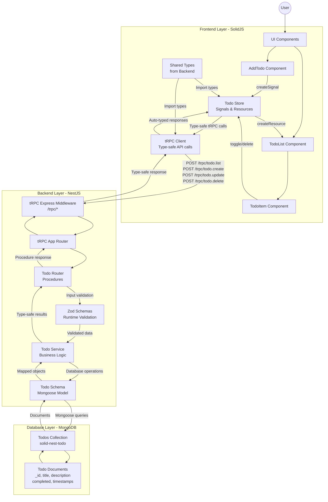

# SolidJS + NestJS + MongoDB Todo App

A full-stack todo application created to familiarize myself with NestJS, SolidJS, tRPC and MongoDB.

## Architecture

- **Frontend**: SolidJS with TypeScript and Vite
- **Backend**: NestJS with TypeScript
- **Database**: MongoDB with Mongoose ODM

## Prerequisites

- Node.js (v16 or higher)
- MongoDB (running locally on port 27017)

## Getting Started

### 1. Start the Backend

```bash
cd backend
npm install
npm run build
npm run start:dev
```

Backend will be available at http://localhost:3001

### 2. Start the Frontend

```bash
cd frontend
npm install
npm run dev
```

Frontend will be available at http://localhost:3000

## Features

- ✅ Add new todos with title and description
- ✅ Mark todos as complete/incomplete
- ✅ Delete todos
- ✅ Real-time updates with SolidJS reactivity
- ✅ Responsive UI
- ✅ TypeScript throughout the stack

## API Endpoints

- `GET /todos` - Get all todos
- `POST /todos` - Create a new todo
- `GET /todos/:id` - Get a specific todo
- `PATCH /todos/:id` - Update a todo
- `DELETE /todos/:id` - Delete a todo

## Project Structure

```
├── backend/          # NestJS backend
│   ├── src/
│   │   ├── todo/     # Todo module
│   │   ├── app.module.ts
│   │   └── main.ts
│   └── package.json
└── frontend/         # SolidJS frontend
    ├── src/
    │   ├── components/
    │   ├── App.tsx
    │   └── main.tsx
    └── package.json
```


