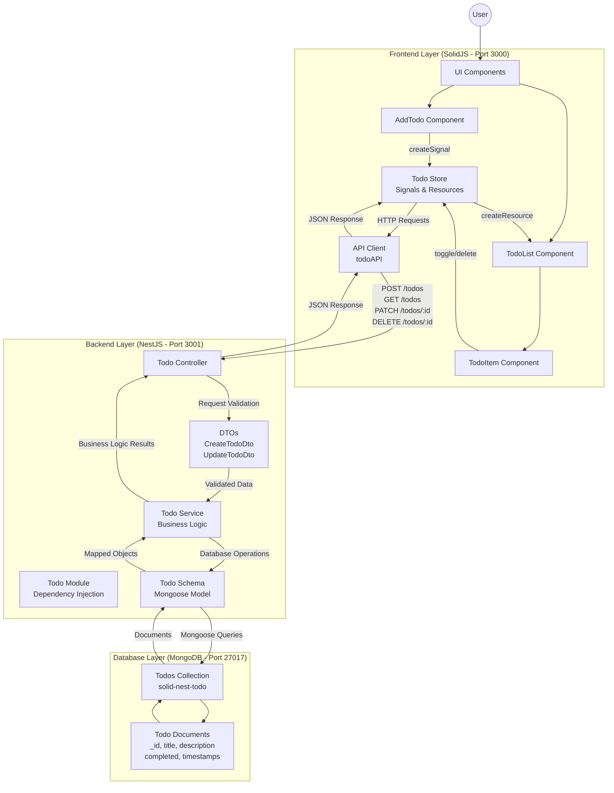
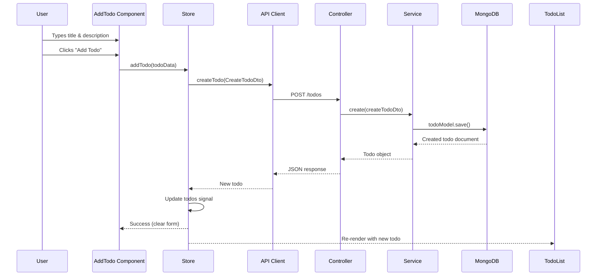
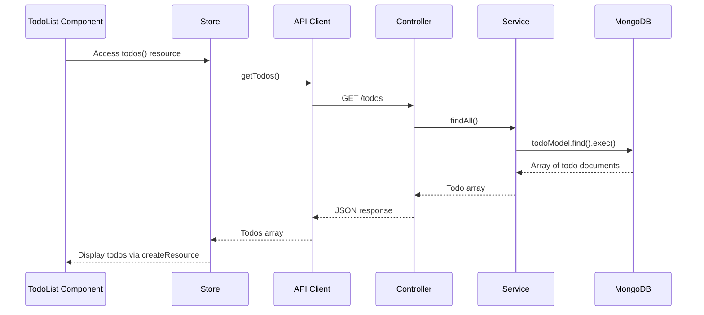
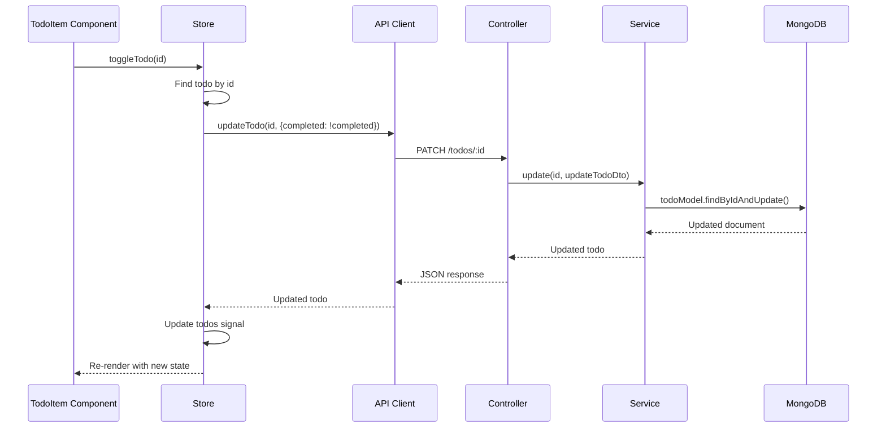

# Data Flow Diagram

```mermaid
graph TB
    subgraph "Frontend Layer (SolidJS - Port 3000)"
        UI[UI Components]
        AddTodo[AddTodo Component]
        TodoList[TodoList Component]
        TodoItem[TodoItem Component]
        
        Store[Todo Store<br/>Signals & Resources]
        API[API Client<br/>todoAPI]
    end
    
    subgraph "Backend Layer (NestJS - Port 3001)"
        Controller[Todo Controller]
        Service[Todo Service<br/>Business Logic]
        Module[Todo Module<br/>Dependency Injection]
        DTO[DTOs<br/>CreateTodoDto<br/>UpdateTodoDto]
        Schema[Todo Schema<br/>Mongoose Model]
    end
    
    subgraph "Database Layer (MongoDB - Port 27017)"
        Collection[Todos Collection<br/>solid-nest-todo]
        Document[Todo Documents<br/>_id, title, description<br/>completed, timestamps]
    end
    
    %% User Interactions
    User((User)) --> UI
    UI --> AddTodo
    UI --> TodoList
    TodoList --> TodoItem
    
    %% Frontend Data Flow
    AddTodo -->|createSignal| Store
    TodoItem -->|toggle/delete| Store
    Store -->|HTTP Requests| API
    API -->|JSON Response| Store
    Store -->|createResource| TodoList
    
    %% API Communication
    API -->|POST /todos<br/>GET /todos<br/>PATCH /todos/:id<br/>DELETE /todos/:id| Controller
    Controller -->|JSON Response| API
    
    %% Backend Data Flow
    Controller -->|Request Validation| DTO
    DTO -->|Validated Data| Service
    Service -->|Database Operations| Schema
    Schema -->|Mongoose Queries| Collection
    Collection -->|Documents| Schema
    Schema -->|Mapped Objects| Service
    Service -->|Business Logic Results| Controller
    
    %% Database Operations
    Collection --> Document
    Document --> Collection
    
```

## Data Flow Scenarios

### 1. Adding a New Todo

```mermaid
sequenceDiagram
    participant U as User
    participant AT as AddTodo Component
    participant S as Store
    participant API as API Client
    participant C as Controller
    participant SVC as Service
    participant DB as MongoDB
    
    U->>AT: Types title & description
    U->>AT: Clicks "Add Todo"
    AT->>S: addTodo(todoData)
    S->>API: createTodo(CreateTodoDto)
    API->>C: POST /todos
    C->>SVC: create(createTodoDto)
    SVC->>DB: todoModel.save()
    DB-->>SVC: Created todo document
    SVC-->>C: Todo object
    C-->>API: JSON response
    API-->>S: New todo
    S->>S: Update todos signal
    S-->>AT: Success (clear form)
    S-->>TodoList: Re-render with new todo
```

### 2. Loading Todos

```mermaid
sequenceDiagram
    participant TL as TodoList Component
    participant S as Store
    participant API as API Client
    participant C as Controller
    participant SVC as Service
    participant DB as MongoDB
    
    TL->>S: Access todos() resource
    S->>API: getTodos()
    API->>C: GET /todos
    C->>SVC: findAll()
    SVC->>DB: todoModel.find().exec()
    DB-->>SVC: Array of todo documents
    SVC-->>C: Todo array
    C-->>API: JSON response
    API-->>S: Todos array
    S-->>TL: Display todos via createResource
```

### 3. Toggling Todo Completion

```mermaid
sequenceDiagram
    participant TI as TodoItem Component
    participant S as Store
    participant API as API Client
    participant C as Controller
    participant SVC as Service
    participant DB as MongoDB
    
    TI->>S: toggleTodo(id)
    S->>S: Find todo by id
    S->>API: updateTodo(id, {completed: !completed})
    API->>C: PATCH /todos/:id
    C->>SVC: update(id, updateTodoDto)
    SVC->>DB: todoModel.findByIdAndUpdate()
    DB-->>SVC: Updated document
    SVC-->>C: Updated todo
    C-->>API: JSON response
    API-->>S: Updated todo
    S->>S: Update todos signal
    S-->>TI: Re-render with new state
```